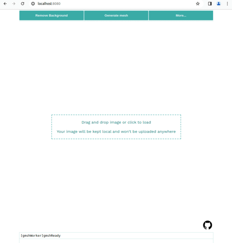

# ARC - Become a mesh

o

This is a pure frontend implementation of the image to mesh workflow originally published [here](https://diegomagela.github.io/2023/09/09/become-a-mesh). The meshing part is done by [gmsh](https://gitlab.onelab.info/gmsh/gmsh) that is compiled into webassembly. There is also an automatic background removal thanks to ONNX and the great u2netp hosted at [rembg](https://github.com/danielgatis/rembg).

Click [here](https://arc.kude.la) for a live demo.

## Building

Requirements:

* node
* emscripten (follow the install instructions [here](https://emscripten.org/docs/getting_started/downloads.html))
* cmake

Steps for building:

Building the webassembly part of the app:
```
git clone https://github.com/lvk88/arc.git
cd arc
mkdir build
cd build
cmake -DCMAKE_TOOLCHAIN_FILE={path_to_emsdk}/upstream/emscripten/cmake/Modules/Platform/Emscripten.cmake -DCMAKE_BUILD_TYPE=Release ../
make -j8 emarclib
```

Building the rest of the app:

```
cd www
npm i
npm run start
```

## Known issues

For some reason, the background removal produces different (in my opinion, worse) results on Firefox than on Chrome. If you have an idea why, you're welcome to open a PR :).